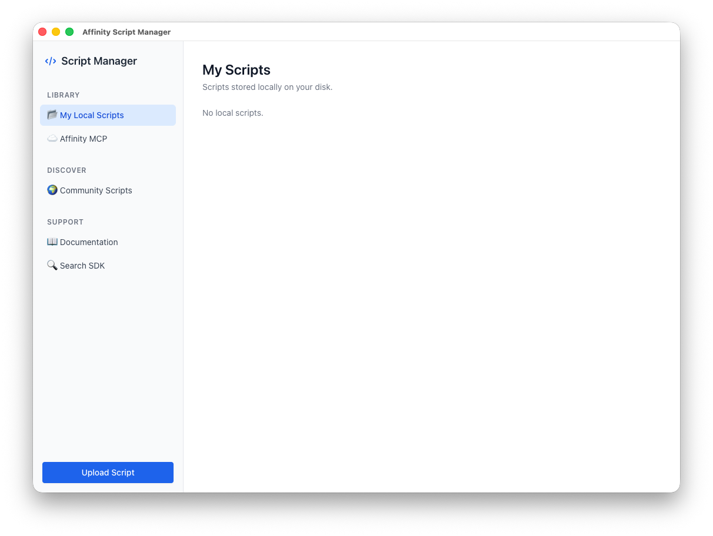

# Affinity Script Manager
ElectronJS based UI manager for Affinity App scripts

## ✨ Features

* **📂 Local Library:** Manage your downloaded and custom `.js` scripts. They are safely stored in your system's native user data folder.
* **☁️ MCP Cloud Sync:** Easily pull scripts from your local MCP server to your computer, or push your local scripts up to the server with a single click.
* **📖 In-App Documentation:** No need to clutter your hard drive. Fetch SDK documentation directly from the MCP server into memory and read it in a clean, split-view Markdown reader.
* **🔍 SDK Search:** Stuck? Search the SDK hints directly from the app. Results are instantly parsed and beautifully formatted in Markdown.
* **💻 Native UI Feel:** Built with Tailwind CSS, the app features a clean, light-mode interface that feels right at home on Mac or Windows.

## 💡 How to Use
**Uploading a Script:** Click "Upload Script" in the sidebar. You can select a .js file from your disk. The app will automatically read it and save it to both your Local Library and the MCP Cloud.

**Downloading:** Go to the "MCP Cloud" tab and click "Download to Library" on any script. It will instantly be saved to your local MyScripts directory.

**Reading Docs:** Click on "Documentation". The app will fetch all available docs from the server and render them on the fly.

## ✅ Roadmap
- [ ] Standard format of Scripts – Autofill info about script into UI
- [ ] Update manager of App – App autoupdate
- [ ] Updating existing scripts from the git repo
- [ ] Better UI
- [ ] App branding