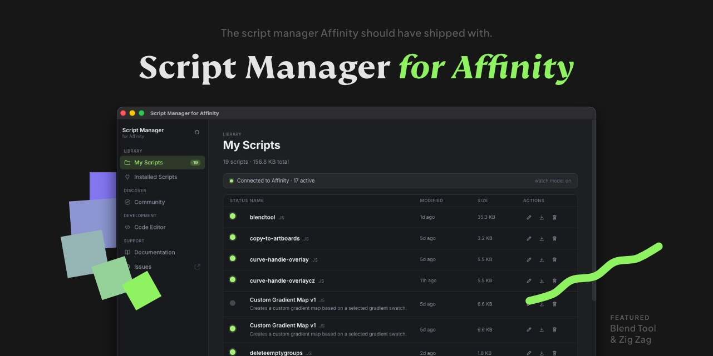

# Affinity Script Manager


## Features

* **My Scripts:** Manage your local `.js` scripts. Files are safely stored in your system's native user data folder and displayed with name, description, size, and last-modified time.
* **Installed Scripts:** See exactly which scripts are currently active inside Affinity via the local MCP bridge. Includes a live connection status, round-trip latency, and an event stream log. Download any bridge script back to your local library with a single click.
* **Install to Affinity:** Each script in your local library has an install dot. Click it (or the whole row) to push the script into Affinity instantly. Active scripts show a green dot so you always know what's live.
* **Watch Mode:** Always-on file watcher. When you save a script that is already installed in Affinity, the app automatically re-pushes it to the bridge — no manual step needed.
* **Community Scripts:** Browse scripts from any GitHub-hosted registry. Filter by category, sort by name, and install directly to your local library and Affinity in one click. Save-only mode lets you inspect or edit a script before activating it.
* **Fork & Edit:** In the Code Editor, pull any community script into your local library and open it for editing immediately.
* **Built-in Code Editor:** Write new scripts from scratch or edit existing ones with a full Ace editor (JavaScript syntax highlighting, dark theme, `Cmd/Ctrl+S` to save). New scripts get a pre-filled metadata header template.
* **In-App Documentation:** Fetch the Affinity SDK documentation directly from the MCP server and read it in a clean Markdown reader — no need to keep a browser tab open.
* **SDK Search:** Search SDK hints from inside the app. Results are parsed and rendered as Markdown.
* **Script Update Badges:** If a community repo ships a newer version of a script you already have locally, an update badge appears in My Scripts. Click it to update in place.
* **Auto-Update Checker:** The app checks GitHub Releases on launch and shows an update button in the sidebar when a new version is available.
* **Metadata Header Parsing:** Import a `.js` file and the app automatically reads its header comment to pre-fill the script's name and description.
* **Drag & Drop:** Drag one or more `.js` files onto the sidebar drop zone to add them to your local library instantly.
* **Export to Disk:** Save any script from your local library to an arbitrary location on your disk via the native save dialog.

---


## How to Use

**Adding a script from disk:** Click **Add Script** in the sidebar (or drag `.js` files onto the drop zone). The app reads the file's metadata header and saves it to your local library.

**Installing a script into Affinity:** In **My Scripts**, click the grey dot on the left of any row (or click anywhere on the row). The dot turns green when the script is live in Affinity.

**Editing a script:** Click the pencil icon in the Actions column, or open the **Code Editor** tab and pick a script from the list. Save with `Cmd+S` (Mac) or `Ctrl+S` (Windows). If the script is already installed in Affinity, Watch Mode will push the update automatically.

**Writing a new script:** Go to **Code Editor** and click **New Script**. A blank buffer opens with a pre-filled metadata header. Give it a name, write your code, then save.

**Community scripts:** Open the **Community** tab. Browse, filter, or search for scripts. Click **Install** to save to your library and push to Affinity simultaneously. Click the save icon instead to download to your library only, for review before installing.

**Forking a community script:** Go to **Code Editor → Community — Fork & Edit** and click **Fork & Edit** on any script. It is saved to your local library and opened in the editor.

**Downloading from Affinity:** Open **Installed Scripts** and click **Download** on any script to save it back to your local library.

**Reading the docs:** Click **Documentation** in the sidebar. The app fetches all available SDK topics from the MCP server and renders them as Markdown.

**Searching the SDK:** Use the search bar in the Documentation screen to query SDK hints directly.

---

## How to Format Your Scripts (Metadata Header)

To make your scripts compatible with the Affinity Script Manager, include a metadata block at the very beginning of your `.js` file. When a user imports your script, the app automatically parses this header and fills in the title and description.

### The Format

Use a standard JavaScript block comment (`/** ... */`) at the **very top** of your file:

```javascript
/**
 * name: Auto Exporter
 * description: Automatically exports all selected layers as PNG files.
 * version: 1.0.0
 * author: Your Name
 */

// --- Your code starts here ---
function exportLayers() {
    // ...
}
```

### Supported Tags

| Tag | Required | Description |
|---|---|---|
| `name` | ✅ | The title of your script as it appears in the library. |
| `description` | Recommended | A short 1–2 sentence explanation of what the script does. |
| `version` | Optional | Current version, e.g. `1.0.0`. Used for update detection. |
| `author` | Optional | Your name or GitHub handle. |

### Parser Rules

- The `/**` must be on the first line of the file (blank lines before it are fine; no code before it).
- One tag per line.
- Tag names must be lowercase (`name:`, not `Name:`).

---

## Adding Custom Repositories

The Affinity Script Manager is completely decentralized. You can add any creator's GitHub repository to access their scripts alongside the default ones.

### How to add a repository

1. Open the **Community** tab.
2. Click the **Repositories** button in the top-right corner.
3. Paste a standard GitHub URL (e.g. `https://github.com/username/repository-name`).
4. Click **Add Repo**.

The app converts the URL to a raw `registry.json` link automatically and fetches the scripts immediately.

---

### For Creators: Publishing Your Own Repository

1. Create a new **public** repository on GitHub.
2. Upload your `.js` scripts.
3. Create a file named `registry.json` in the root of the repository on the main branch.
4. Format it like this:

```json
{
  "scripts": [
    {
      "name": "My Awesome Script",
      "description": "Does something amazing with layers.",
      "version": "1.0.0",
      "author": "Your Name",
      "category": "Layers",
      "download_url": "https://raw.githubusercontent.com/username/repo/main/my-script.js"
    }
  ]
}
```

> Make sure `download_url` points to the **raw** version of your `.js` file.

Once your `registry.json` is in place, anyone can paste your GitHub link into the app and install your scripts with a single click.

---

## Installation on macOS

1. Go to the [Releases](https://github.com/JiriKrblich/Affinity-Script-Manager/releases/latest) page and download the latest `.dmg` file.
2. Open the downloaded `.dmg`, then drag **Affinity Script Manager** into your **Applications** folder.
3. Try to open the app. macOS will block it with a message like *"Script Manager for Affinity cannot be opened because it is from an unidentified developer."*
4. Open **System Settings → Privacy & Security**.
5. Scroll down to the Security section. You will see a message about the blocked app — click **Open Anyway**.
6. In the confirmation dialog that appears, click **Open** (you may be asked for your password).

The app is now approved and will open normally from this point on.

> **Note:** This prompt only appears because the app is not notarized with an Apple Developer certificate. The source code is fully open — you can inspect it in this repository before running it.


---

## Disclaimer

This project is not affiliated with Affinity or Canva. Affinity is a trademark of Canva.
